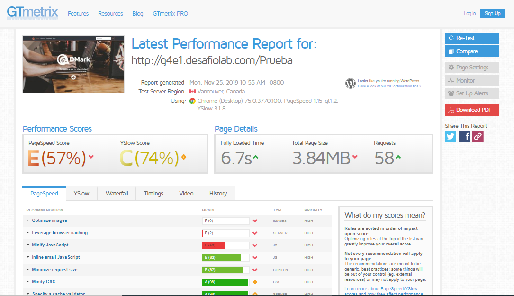
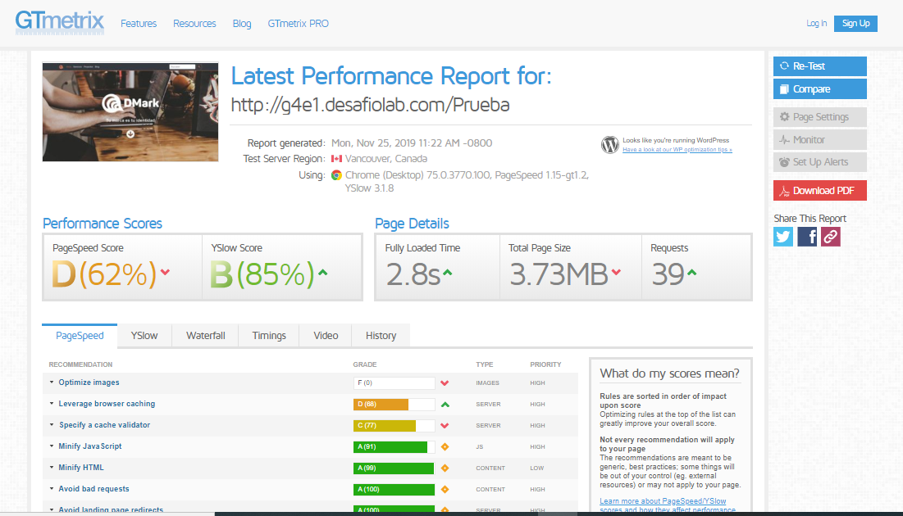
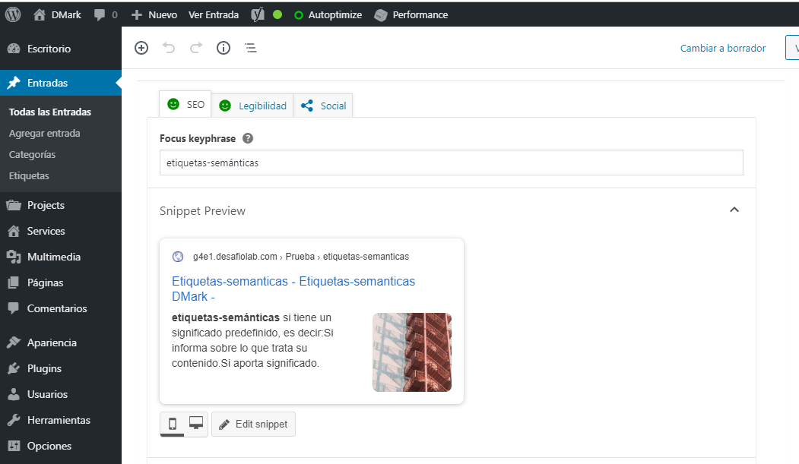
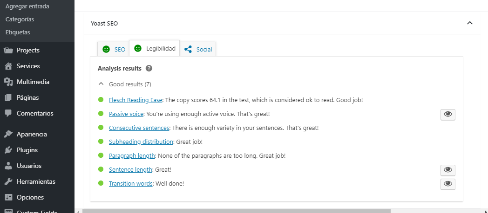
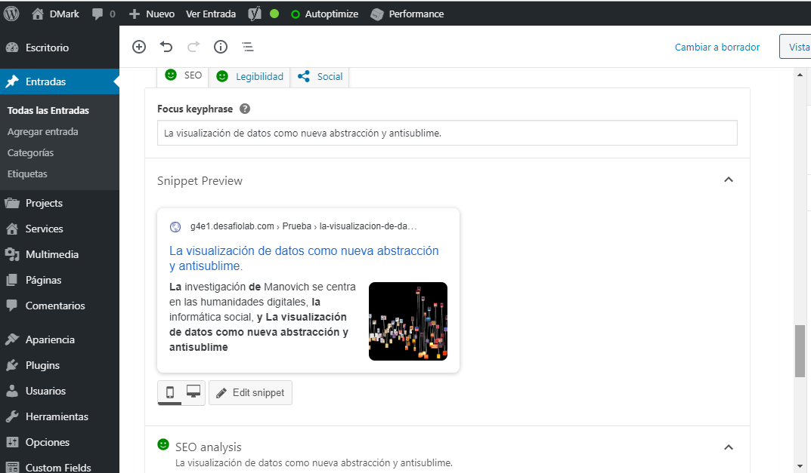
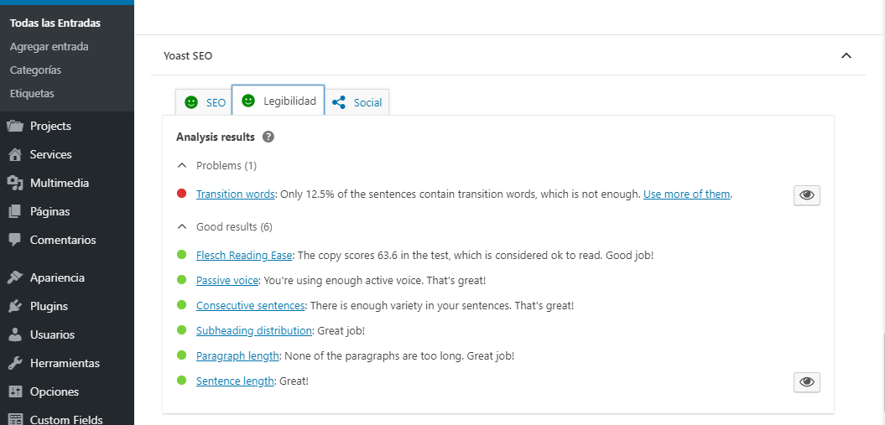
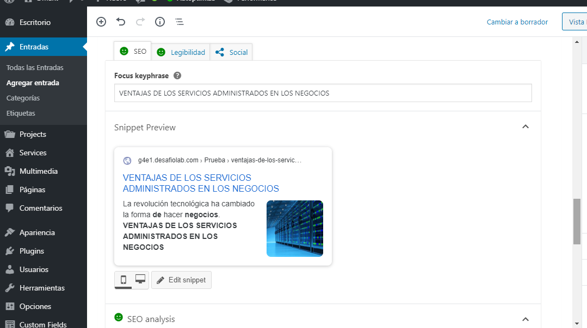
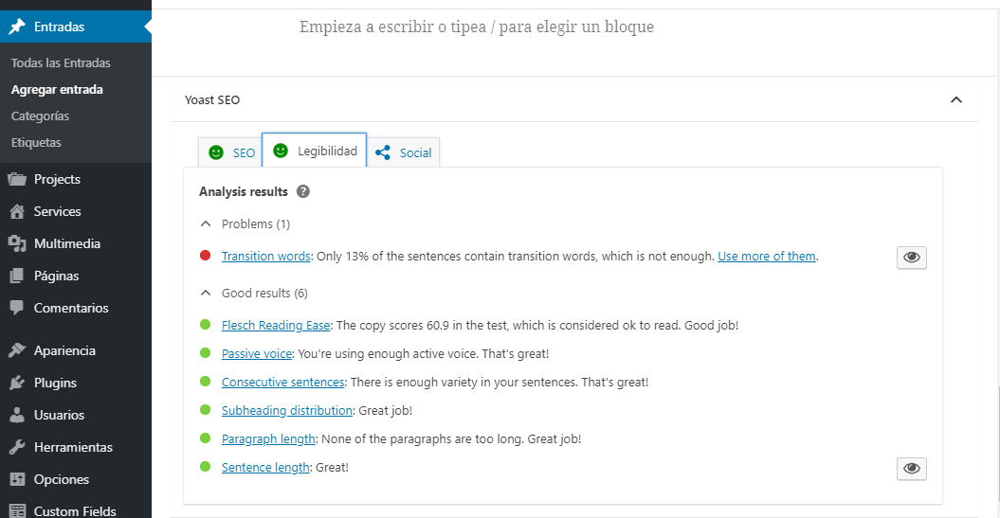
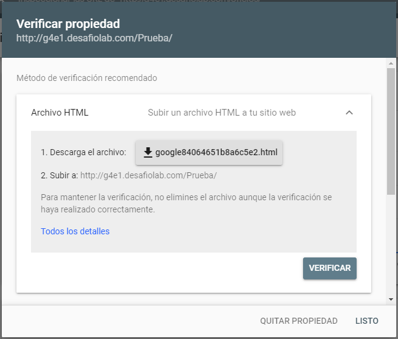
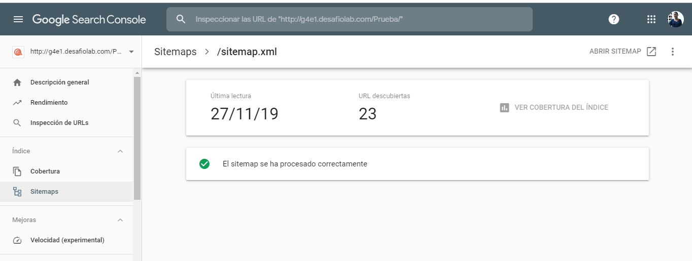

# Prueba final - Dmark, tu marca es tu identidad.

- URL del sitio: [http://g4e1.desafiolab.com/Prueba](http://g4e1.desafiolab.com/Prueba)

- usuario y contraseña del sitio
- usuario: prueba_usr
- contraseña: Da1agarc1a*1986

- Aspectos de seguridad que optimicé:
	- Revisar si WordPress está actualizado.
  - Usar claves robustas y cuidar los permisos de usuario.
  - Instalar plugin de seguridad.

- Optimización:
	- Resultado anterior a la optimización:

	

	- Resultado posterior a la optimización:

	

  - Analisis SEO de las entradas
  - Entrada 1
   
   

  - Entrada 2
    
    

  - Entrada 3
   
   

- Integración con Google Search Console:

- URL del sitemap: [http://g4e1.desafiolab.com/Prueba/sitemap.xml](http://g4e1.desafiolab.com/Prueba/sitemap.xml)

